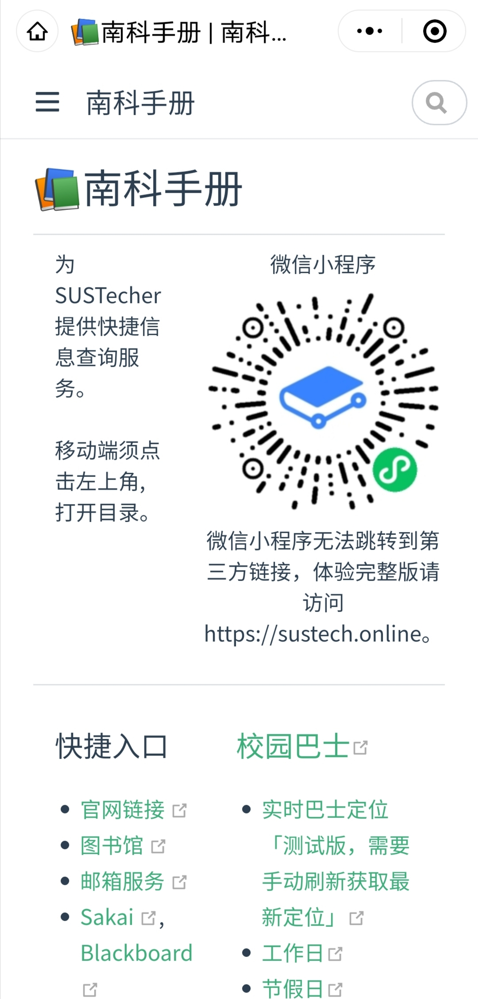

# 南科手册 - 小程序

Online manual for SUSTecher.

**微信小程序二维码**

**截图**

## 帮助我们完善

主项目托管在 [SUSTC/sustech-online-ng](https://github.com/sustc/sustech-online-ng)

小程序托管在 [SUSTC/sustech-online-wxapp](https://github.com/SUSTC/sustech-online-wxapp)

## 编译和测试
1. 下载并安装微信开发者工具：https://developers.weixin.qq.com/miniprogram/dev/devtools/download.html
2. 申请测试号，获取 AppID：https://developers.weixin.qq.com/miniprogram/dev/devtools/sandbox.html
3. 配置业务域名（web-view中需要访问的网站）
4. 在 `project.config.json` 中修改小程序 AppID 的字段 `appid`
5. 打开微信开发者工具导入项目

## 提示
* 项目依赖 web-view，如需发布仅支持企业、个体户注册的小程序号，不支持个人号。
* 业务域名需要验证，仅能访问在白名单中的域名